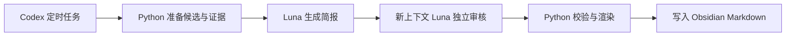

# AI Daily Workflow

**基于 Codex 与 Obsidian 的个性化资讯工作流，定时生成日报与周报，自动写入你的本地知识库。**

[](https://github.com/haoran3160-afk/AI_Daily_workflow/actions/workflows/ci.yml)
[](LICENSE)


让预先选好的信息源，按适合阅读的节奏进入 Obsidian：每天关注两个主题，周日回顾六个方向。
Codex 负责内容生成与独立审核，Python 负责抓取、去重、校验和写入；留下的是带原文出处、有具体判断的 Markdown 简报。

[开始使用](docs/getting-started.md) · [运行手册](docs/ai-daily-luna.md) · [配置说明](docs/configuration.md) · [参与开发](CONTRIBUTING.md)

> 当前版本面向个人本地部署，已提供完整处理链路与自包含测试。私有信息源、用户上下文和 Codex 自动任务需要自行配置，尚不是克隆后零配置运行的托管服务。

## 你会得到什么

- **少而相关的日报**：每天两个轮换模块，每个模块一条内容，排除已推荐链接及常见追踪参数变体。
- **有联系的周报**：从本周已发布日报及其证据中汇总六个方向，保留来源日期，不把旧内容包装成新消息。
- **面向科研的论文导读**：解释研究问题、已有缺口、核心方法、实验边界和待验证的研究线索，兼顾 Agent、Harness、强化学习与深度学习。
- **面向自用的项目推荐**：记录 GitHub Star 快照，说明具体用途、输入输出、上手条件及需要改造的部分。
- **可追溯的阅读体验**：原文链接、轻量图标与个人推荐级别随简报保留；推荐级别表示阅读优先级，不代表客观质量分。
- **克制的写入方式**：独立审核通过后才发布；同名笔记已存在时跳过，不静默覆盖。

## 日报与周报节奏

默认在上海时间 **08:00 开始运行**，处理完成后写入笔记。

| 时间 | 阅读内容 |
| --- | --- |
| 周一／周四 | 🧪 学术研究 ＋ 🛠️ AI 实践 |
| 周二／周五 | 🚀 Builder／一人公司 ＋ 🧭 创投与产业 |
| 周三／周六 | 💡 认知与成长 ＋ 🧰 GitHub 项目 |
| 周日 | 六模块周报，不再叠加日报 |

输出沿用日期命名，例如：

```text
30-Daily/
├── AI-Daily-2026-09-07.md
├── AI-Daily-2026-09-08.md
└── AI-Weekly-2026-09-13.md
```

以上仅为命名示例。内容不足、审核失败或环境不可用时，流程会报告原因，不为填满栏目编造内容。

## Codex、Python 与 Obsidian 如何协作



日报准备新候选；周报准备已验证的日报材料。两者复用同一条生成、审核和发布链路。

**模型工作在 Codex 会话中完成。** 单独执行 Python 命令只会推进准备、校验或发布阶段，不会自行调用模型。
当前部署使用 `gpt-5.6-luna / medium`，不通过 DeepSeek API、另购 OpenAI API 或嵌套 Codex CLI 生成内容。

## 开始使用

需要 Windows、Python 3.12、Git、Codex 桌面应用与本地 Obsidian Vault；GitHub 项目元数据抓取还使用 GitHub CLI。
先在本地验证代码：

```powershell
git clone https://github.com/haoran3160-afk/AI_Daily_workflow.git
cd AI_Daily_workflow
python -m venv .venv
.\.venv\Scripts\python.exe -m pip install -r requirements-dev.txt
.\.venv\Scripts\python.exe -m pytest tests
```

随后按 [本地上手指南](docs/getting-started.md) 配置外部信息源、批准的用户上下文和输出目录，再在 Codex 中设置自动任务。
完整的三阶段操作、返回状态和恢复边界见 [运行手册](docs/ai-daily-luna.md)。

本地定时任务需要电脑开机、Codex 保持运行，并能够访问项目目录。
08:00 是启动时间，不是保证完成时间；账户额度、网络及来源可用性仍会影响运行。[官方运行条件](https://learn.chatgpt.com/docs/automations?surface=app)

## 项目结构

```text
AI_Daily_workflow/
├── src/pkm_workflow/       # 抓取、策展、生成契约、审核与发布
├── scripts/               # 稳定的命令入口
├── tests/                 # 自包含行为测试
├── docs/                  # 上手、配置、架构、运行与开发文档
├── examples/              # 配置边界与示意
└── .github/workflows/      # 持续集成
```

私有配置、Vault 和 runtime 都在仓库之外。详细模块分工见 [架构说明](docs/architecture.md)。

## 隐私与运行边界

- 公开仓库不包含用户笔记、私有配置、凭据、模型草稿或运行收据。
- “本地知识库”不等于“模型离线运行”：选定的证据和批准的上下文会交给 Codex 处理。
- 不扫描无关 Vault 内容、不修改 `.obsidian`，也不执行推荐项目的代码。
- 正常每份简报进行一次生成、一次独立审核；结构或编辑修正共享一次机会。
- 日报证据输入上限 12,000 字符，周报 24,000 字符。这是证据字符上限，不是总 token 上限，也不意味着免费。
- 首周材料不足时，周报会保留单例与趋势之间的区别；不能用不足的历史推导长期结论。

更多说明见 [配置与数据边界](docs/configuration.md) 和 [运行手册](docs/ai-daily-luna.md)。

## 文档与贡献

从 [文档索引](docs/README.md) 选择适合你的入口。提交问题或改进前，请阅读 [贡献指南](CONTRIBUTING.md)，不要附带私人笔记或未经脱敏的运行数据。

项目的开发基线与演进记录保留在 [项目历史](docs/history.md)；本次目录与文档组织参考见 [参考项目](docs/repository-design.md)。

## License

[MIT](LICENSE)
